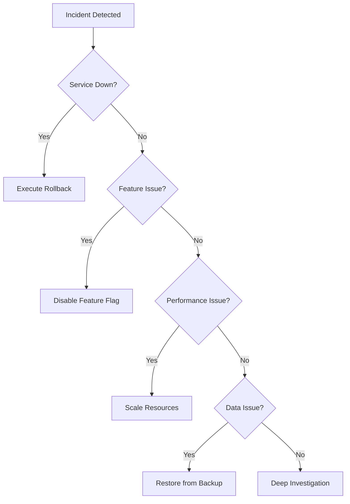
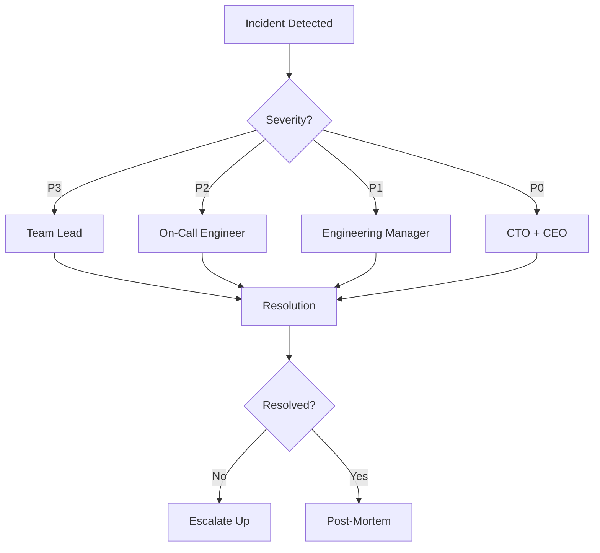

# HangJegyzet Incident Response Playbook

## Quick Reference

**Incident Command Center**: #incident-response (Slack)  
**Status Page**: https://status.hangjegyzet.hu  
**On-Call Schedule**: [PagerDuty/OpsGenie Link]  
**War Room Link**: [Zoom/Meet Link]  

### Severity Levels

| Level | Impact | Response Time | Authority | Examples |
|-------|--------|--------------|-----------|----------|
| P0 | Complete outage | < 5 min | Any engineer | Site down, data loss |
| P1 | Major degradation | < 15 min | Senior engineer | Payment failure, API down |
| P2 | Significant issues | < 30 min | On-call engineer | Slow performance, partial outage |
| P3 | Minor issues | < 2 hrs | Team lead | UI bugs, non-critical features |

## Phase 1: Detection & Assessment (0-5 minutes)

### 1.1 Automatic Detection
- **Monitoring Alerts**
  - Sentry: Error rate > 5%
  - Uptime: Site unreachable
  - API: Response time > 5s
  - Database: Connection failures
  - Payment: Transaction failures > 10%

### 1.2 Manual Detection
- Customer reports via support
- Internal team observations
- Social media mentions
- Performance degradation

### 1.3 Initial Assessment

```bash
# Quick health check commands
curl -I https://hangjegyzet.hu
curl https://hangjegyzet.hu/api/health
vercel logs --prod --follow

# Check error rates
open https://sentry.io/organizations/hangjegyzet/issues/
```

**Assessment Checklist:**
- [ ] Confirm the issue is real (not false positive)
- [ ] Determine scope of impact
- [ ] Identify affected components
- [ ] Estimate number of affected users
- [ ] Check recent deployments

## Phase 2: Incident Declaration (5-10 minutes)

### 2.1 Declare Incident

**Slack Template:**
```
@here INCIDENT DECLARED - [P0/P1/P2/P3]
Issue: [Brief description]
Impact: [User impact]
IC: @[incident-commander]
Thread for updates 🧵
```

### 2.2 Assign Roles

| Role | Responsibility | Backup |
|------|---------------|--------|
| Incident Commander (IC) | Overall coordination | Tech Lead |
| Technical Lead | Solution implementation | Senior Dev |
| Communications Lead | Updates & notifications | Product Manager |
| Scribe | Documentation | Any team member |

### 2.3 Open Communication Channels

1. **Create Incident Channel**: #incident-YYYYMMDD-description
2. **Start War Room**: [Video call link]
3. **Update Status Page**: Initial acknowledgment
4. **Set Update Cadence**: Every 15 minutes for P0/P1

## Phase 3: Triage & Mitigation (10-30 minutes)

### 3.1 Triage Decision Tree



### 3.2 Common Mitigation Actions

#### A. Application Issues
```bash
# Quick rollback
./deployment/rollback-application.sh --force

# Disable all features
./deployment/disable-features.sh --all --emergency

# Clear all caches
./deployment/clear-caches.sh --all
```

#### B. Database Issues
```bash
# Check database status
psql $DATABASE_URL -c "SELECT version();"

# Kill long-running queries
psql $DATABASE_URL -c "SELECT pg_terminate_backend(pid) FROM pg_stat_activity WHERE state = 'active' AND query_time > interval '5 minutes';"

# Emergency rollback
./deployment/rollback-migration.sh
```

#### C. Performance Issues
```bash
# Scale Vercel functions
vercel scale --prod --min 5 --max 20

# Increase rate limits temporarily
./deployment/disable-features.sh --feature rate-limiting-enabled
```

#### D. Third-party Service Issues
```bash
# Switch to fallback providers
export OPENAI_API_KEY=$BACKUP_OPENAI_KEY
export TRANSCRIPTION_PROVIDER=whisper-local

# Enable degraded mode
./deployment/enable-degraded-mode.sh
```

### 3.3 Monitoring During Mitigation

- Watch error rates: Should drop within 5 minutes
- Monitor response times: Should improve immediately
- Check user reports: New reports should stop
- Verify fixes: Run health checks continuously

## Phase 4: Communication (Continuous)

### 4.1 Internal Updates

**Update Template (every 15 min):**
```
UPDATE [HH:MM]
Status: [Investigating/Identified/Monitoring/Resolved]
Current Actions: [What we're doing]
Next Steps: [What's next]
ETA: [Best estimate]
```

### 4.2 External Communication

#### Status Page Updates

**Initial (< 5 min):**
```
We are currently investigating reports of [issue description].
Our team is working to identify and resolve the issue.
```

**Update (every 30 min):**
```
Identified: [Root cause if known]
Impact: [Specific impact]
Progress: [What's being done]
ETA: [Resolution estimate]
```

**Resolution:**
```
The issue has been resolved. All services are operational.
We apologize for any inconvenience caused.
A full postmortem will be published within 48 hours.
```

#### Customer Email (if > 30 min downtime)

```
Subject: Service Disruption - HangJegyzet

Dear Customer,

We experienced a service disruption from [start] to [end].

Impact: [What was affected]
Resolution: [Current status]
Next Steps: [What customers should do]

We sincerely apologize for the inconvenience.

Best regards,
The HangJegyzet Team
```

### 4.3 Social Media Response

**Twitter/X Template:**
```
We're aware of issues affecting HangJegyzet and are working on a fix. 
Updates: https://status.hangjegyzet.hu
```

## Phase 5: Resolution & Recovery (30-60 minutes)

### 5.1 Verify Resolution

```bash
# Run comprehensive health check
./deployment/verify-rollback.sh

# Check all endpoints
for endpoint in / /api/health /login /dashboard; do
  echo "Checking $endpoint..."
  curl -s -o /dev/null -w "%{http_code} - %{time_total}s\n" https://hangjegyzet.hu$endpoint
done

# Monitor for 15 minutes
watch -n 60 'curl -s https://hangjegyzet.hu/api/health | jq .'
```

### 5.2 Gradual Recovery

1. **Keep features disabled** for 30 minutes
2. **Monitor metrics** closely
3. **Re-enable features** one by one
4. **Clear degraded mode** when stable
5. **Remove rate limit increases**

### 5.3 All-Clear Criteria

- [ ] Error rate < 0.1% for 30 minutes
- [ ] Response time < 2s (p95) for 30 minutes
- [ ] No new error reports
- [ ] All health checks passing
- [ ] Team consensus on stability

## Phase 6: Post-Incident (Next 48 hours)

### 6.1 Immediate Actions (2-4 hours)

1. **Close Incident**
   ```
   INCIDENT RESOLVED [HH:MM]
   Duration: XX minutes
   Root Cause: [Brief summary]
   Customer Impact: [Statistics]
   Post-mortem scheduled for: [Date/Time]
   ```

2. **Thank the Team**
   - Acknowledge everyone involved
   - Note exceptional contributions
   - Schedule debrief meeting

3. **Preserve Evidence**
   - Export logs
   - Save metrics/graphs
   - Document timeline
   - Collect screenshots

### 6.2 Post-Mortem Process (24-48 hours)

#### Post-Mortem Template

```markdown
# Incident Post-Mortem: [Date] [Title]

## Summary
- **Date**: YYYY-MM-DD
- **Duration**: XX minutes
- **Severity**: P0/P1/P2/P3
- **Customer Impact**: X% of users, Y minutes

## Timeline
- HH:MM - Initial detection
- HH:MM - Incident declared
- HH:MM - Root cause identified
- HH:MM - Mitigation applied
- HH:MM - Resolution confirmed

## Root Cause Analysis

### What Happened
[Detailed technical explanation]

### Why It Happened
[5 Whys analysis]

### Contributing Factors
- [ ] Recent deployment
- [ ] Configuration change
- [ ] Increased load
- [ ] Third-party failure
- [ ] Human error

## Impact
- Users affected: X
- Revenue impact: $Y
- Data loss: None/Minimal/Significant
- Reputation impact: Assessment

## What Went Well
- Quick detection
- Effective communication
- Rapid mitigation

## What Went Poorly
- Delayed response
- Confusion about ownership
- Missing runbooks

## Action Items
| Action | Owner | Due Date | Priority |
|--------|-------|----------|----------|
| Improve monitoring | @person | YYYY-MM-DD | High |
| Update runbooks | @person | YYYY-MM-DD | Medium |
| Add testing | @person | YYYY-MM-DD | High |

## Lessons Learned
1. [Key learning #1]
2. [Key learning #2]
3. [Key learning #3]
```

### 6.3 Follow-up Actions

1. **Implement Fixes**
   - Address root cause
   - Improve monitoring
   - Update documentation
   - Add tests

2. **Process Improvements**
   - Update runbooks
   - Refine alerts
   - Training needs
   - Tool improvements

3. **Communication**
   - Publish post-mortem
   - Share learnings
   - Update customers
   - Recognition

## Appendix A: Contact Lists

### Internal Contacts

| Role | Primary | Backup | Contact |
|------|---------|--------|---------|
| CTO | Name | Name | Slack/Phone |
| Engineering Lead | Name | Name | Slack/Phone |
| DevOps Lead | Name | Name | Slack/Phone |
| Product Manager | Name | Name | Slack/Phone |
| Customer Success | Name | Name | Slack/Phone |

### External Contacts

| Service | Contact | Available Hours |
|---------|---------|----------------|
| Vercel Support | support@vercel.com | 24/7 |
| Database Support | DBA contact | Business hours |
| Payment (Stripe) | Stripe dashboard | 24/7 |
| CDN Support | Support ticket | 24/7 |

## Appendix B: Quick Commands

### Health Checks
```bash
# Full system health
curl https://hangjegyzet.hu/api/health | jq .

# Database health
psql $DATABASE_URL -c "SELECT count(*) FROM meetings;"

# Redis health
redis-cli ping

# Feature flags
curl https://hangjegyzet.hu/api/feature-flags
```

### Rollback Commands
```bash
# Application rollback
./deployment/rollback-application.sh --force

# Database rollback
./deployment/rollback-migration.sh

# Feature disable
./deployment/disable-features.sh --all

# Cache clear
./deployment/clear-caches.sh --all
```

### Monitoring Commands
```bash
# Live logs
vercel logs --prod --follow

# Error tracking
open https://sentry.io/organizations/hangjegyzet/

# Performance metrics
open https://vercel.com/dashboard

# Database metrics
psql $DATABASE_URL -c "SELECT * FROM pg_stat_activity;"
```

## Appendix C: Decision Matrices

### Rollback Decision Matrix

| Symptom | Threshold | Action |
|---------|-----------|--------|
| 5xx errors | > 5% | Rollback app |
| Response time | > 5s p95 | Scale up |
| DB errors | > 100/min | Check connections |
| Payment fails | > 10% | Check Stripe |
| Memory usage | > 90% | Restart services |

### Communication Matrix

| Duration | Internal Update | External Update | Executive Update |
|----------|----------------|-----------------|------------------|
| < 5 min | Slack thread | None | None |
| 5-15 min | Slack + War room | Status page | None |
| 15-30 min | Every 10 min | Every 15 min | Initial brief |
| 30-60 min | Every 15 min | Every 30 min | Every 30 min |
| > 60 min | Every 30 min | Every hour | Every hour |

## Appendix D: Escalation Paths



---

**Document Version**: 1.0  
**Last Updated**: 2025-01-07  
**Owner**: Engineering Team  
**Review Schedule**: Quarterly  
**Next Review**: 2025-04-07