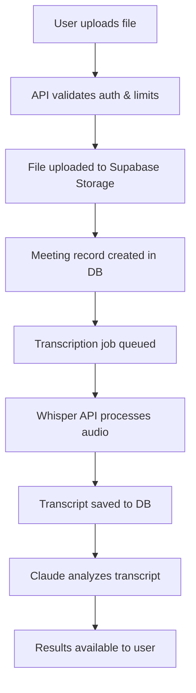

# File Processing Architecture

## Overview

HangJegyzet.AI processes audio/video files through a multi-stage pipeline that ensures security, reliability, and optimal user experience.

## File Upload Flow

### 1. Client-Side Upload
- Users drag & drop or select files on the dashboard
- Supported formats: MP3, WAV, M4A, AAC (audio) and MP4, MOV, AVI (video)
- Maximum file size: 500MB
- Files are uploaded directly to the browser via FormData

### 2. Server-Side Processing



### 3. Storage Architecture

#### Supabase Storage Buckets
- **meetings/** - Raw audio/video files
  - Structure: `{organization_id}/{timestamp}-{filename}`
  - Access: Private, authenticated users only
  - Retention: Based on subscription plan (30-∞ days)

#### Database Storage
- **meetings table** - Meeting metadata and transcripts
- **Transcript format**: JSONB with timestamps, speakers, and text
- **Encrypted at rest**: Sensitive meeting content

### 4. Transcription Pipeline

#### Step 1: Audio Extraction (for video files)
```typescript
// If video file, extract audio track
if (file.type.startsWith('video/')) {
  audioUrl = await extractAudioFromVideo(fileUrl)
} else {
  audioUrl = fileUrl
}
```

#### Step 2: Whisper API Processing
```typescript
const transcription = await openai.audio.transcriptions.create({
  file: audioStream,
  model: "whisper-1",
  language: "hu", // Hungarian
  response_format: "verbose_json", // Includes timestamps
  temperature: 0.2, // Lower = more accurate
})
```

#### Step 3: Post-Processing
- Speaker diarization (identify different speakers)
- Timestamp alignment
- Hungarian business terminology correction
- Punctuation and formatting

### 5. Output Formats

Users can download transcripts in multiple formats:

#### Text Formats
- **PDF** - Formatted document with speaker labels
- **DOCX** - Editable Word document
- **TXT** - Plain text for further processing
- **SRT** - Subtitle format with timestamps
- **JSON** - Structured data for integrations

#### Example PDF Output:
```
Meeting Transcript - Q1 Planning Meeting
Date: 2024-01-15
Duration: 45 minutes
Participants: 4

---

[00:00:15] János: Kezdjük el a Q1 tervezést...
[00:00:45] Eszter: Az előző negyedév eredményei alapján...
```

### 6. File Lifecycle

1. **Upload** - Files stored in Supabase Storage
2. **Processing** - 5-30 minutes depending on length
3. **Active** - Available for viewing/downloading
4. **Archive** - After retention period:
   - Trial/Starter: 30/90 days - files deleted
   - Professional/Enterprise: Archived to cold storage
5. **Deletion** - User-initiated or automatic

### 7. Security Measures

- **Encryption**: All files encrypted at rest (AES-256)
- **Access Control**: Row-level security in Supabase
- **Signed URLs**: Temporary access for downloads
- **Virus Scanning**: Files scanned on upload
- **DLP**: Sensitive data detection and flagging

### 8. Performance Optimizations

- **Chunked uploads** for large files
- **CDN delivery** for processed files
- **Background processing** with job queues
- **Caching** of frequently accessed transcripts

### 9. Usage Tracking

```typescript
// Track usage for billing
await incrementUsage({
  organization_id: meeting.organization_id,
  minutes: Math.ceil(duration / 60),
  month: new Date().toISOString().slice(0, 7)
})
```

### 10. Error Handling

- **Retry logic** for failed transcriptions
- **Partial results** saved if processing fails
- **User notifications** via email/in-app
- **Manual re-processing** option

## Implementation Status

- ✅ File upload endpoint
- ✅ Supabase Storage integration
- ✅ Meeting record creation
- ✅ Usage limit checking
- ⏳ Whisper API integration
- ⏳ Audio extraction from video
- ⏳ Export format generation
- ⏳ Background job processing
- ⏳ Real-time status updates