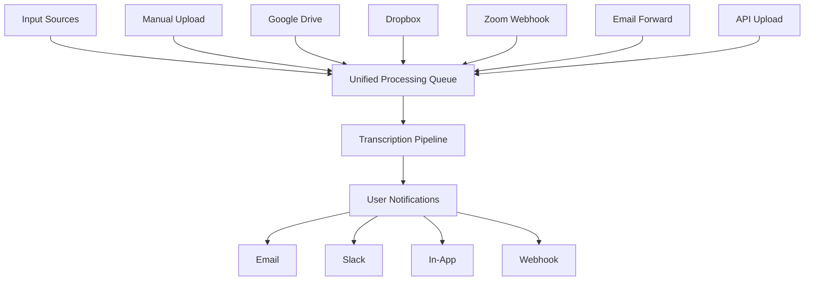

# Integration Roadmap - My Honest Take

## Current State: Manual Upload Only 🤷
Users must manually upload files. This is like asking people to burn CDs in the Spotify era.

## Phase 1: Google Drive Integration (Week 1-2) ⭐⭐⭐⭐⭐
**Why this first:** 80% of your target market uses Google Workspace

### Implementation:
```typescript
// User connects Google Drive
await connectGoogleDrive() 

// User selects folder to watch
const watchFolder = await selectDriveFolder()

// Background job monitors folder
onNewFile(watchFolder, async (file) => {
  if (isAudioOrVideo(file)) {
    await processAutomatically(file)
  }
})
```

### User Experience:
1. One-time setup: "Connect Google Drive" → Select folder
2. Drop any meeting recording in that folder
3. Get email/notification when transcript ready
4. Magic! ✨

## Phase 2: Calendar Integration (Week 3) ⭐⭐⭐⭐⭐
**The feature nobody asked for but everyone needs**

### Google Calendar Integration:
- See upcoming meetings in dashboard
- One-click "Record this meeting" 
- Auto-title meetings from calendar event
- Invite participants to view transcript

### Outlook Calendar:
- Same features for Microsoft users
- Important for enterprise clients

## Phase 3: Zoom Integration (Week 4-6) ⭐⭐⭐⭐
**Why this matters:** Zoom dominance in business meetings

### Two Approaches:

#### Option A: Zoom App (Recommended)
- Official Zoom App in marketplace
- Auto-joins meetings as bot
- Records + transcribes in real-time
- No user action needed

#### Option B: Zoom Cloud Recording Webhook
- When meeting ends → Zoom sends recording
- We process automatically
- Simpler but requires Pro/Business Zoom

### Implementation Reality Check:
- Zoom approval: 2-4 weeks
- Development: 1 week
- Testing: 1 week

## Phase 4: The Game Changers (Month 2-3) 🚀

### 1. Email Integration ⭐⭐⭐⭐
```
Forward any meeting recording to: meeting@hangjegyzet.ai
Auto-processes and sends back transcript
```

### 2. Mobile App ⭐⭐⭐
- Record in-person meetings
- Instant upload from phone
- Push notifications for results

### 3. Microsoft Teams Integration ⭐⭐⭐⭐
- Growing in Hungarian enterprises
- Similar to Zoom technically
- Differentiator vs competitors

### 4. Slack/Teams Notifications ⭐⭐⭐
- Transcript ready → Post to Slack channel
- Action items → Create tasks in Asana/Trello
- Summary → Update CRM

### 5. API Webhooks ⭐⭐⭐⭐⭐
Let power users build their own integrations:
```javascript
// Customer's webhook receives:
{
  event: "transcript.completed",
  meeting: { id, title, duration },
  transcript: { text, segments },
  summary: "...",
  actionItems: [...],
  intelligenceScore: 92
}
```

## What I'd Build First (Honest Priority):

### Month 1: Foundation
1. ✅ Manual upload (done)
2. 🔄 Google Drive watch folder
3. 🔄 Email integration (quick win)
4. 🔄 Basic API

### Month 2: Growth
1. 🔄 Zoom cloud recording
2. 🔄 Calendar integration
3. 🔄 Slack notifications

### Month 3: Domination
1. 🔄 Zoom bot (if approved)
2. 🔄 Teams integration
3. 🔄 Mobile app

## Technical Architecture for Integrations



## Security Considerations

### OAuth Tokens
- Store encrypted in database
- Refresh automatically
- Revoke on user request
- Audit all access

### File Access
- Minimal permissions requested
- Read-only access where possible
- User controls which folders
- Clear data retention policy

## The Brutal Truth

**What separates good from great:**
- Otter.ai succeeded because of Zoom integration
- Notion won with excellent integrations
- Slack killed email with integrations

**Your competitive advantage:**
- Hungarian language optimization
- Local integrations (Hungarian CRMs, tools)
- GDPR compliance by default
- Understanding Hungarian business culture

## My Recommendation

1. **Week 1-2**: Ship Google Drive integration
   - Biggest bang for buck
   - Technically straightforward
   - Immediate user value

2. **Week 3-4**: Add email forward + basic API
   - Quick wins
   - Shows momentum
   - Enables power users

3. **Month 2**: Zoom + calendar
   - Game changers
   - Marketing differentiators
   - Premium tier features

**Skip for now:**
- Dropbox (low Hungarian usage)
- Complex enterprise integrations
- Native mobile apps (use web for now)

## Code Example: Google Drive Integration

```typescript
// Simple implementation that works
class GoogleDriveIntegration {
  async watchFolder(userId: string, folderId: string) {
    // Set up webhook for folder changes
    const webhook = await drive.files.watch({
      fileId: folderId,
      requestBody: {
        id: uuid(),
        type: 'web_hook',
        address: `${process.env.APP_URL}/api/integrations/gdrive/webhook`,
        token: await generateSecureToken(userId),
      }
    })
    
    // Store webhook info
    await supabase.from('integration_webhooks').insert({
      user_id: userId,
      type: 'google_drive',
      folder_id: folderId,
      webhook_id: webhook.data.id,
      expires_at: webhook.data.expiration,
    })
  }
  
  async handleWebhook(notification: any) {
    // Get new files in folder
    const files = await drive.files.list({
      q: `'${notification.folderId}' in parents and mimeType contains 'audio'`,
      orderBy: 'createdTime desc',
      pageSize: 10,
    })
    
    // Process new files
    for (const file of files.data.files) {
      await this.processFile(file)
    }
  }
}
```

## Final Thought

**Build integrations that make users say:**
"Wow, it just works! I don't even have to think about it."

That's how you get to €50k MRR.