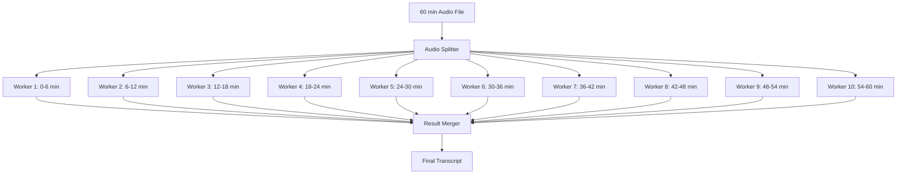

# Parallel Processing Architecture 🚀

## The Game-Changing Idea

Instead of processing a 60-minute meeting in 60 minutes, we process it in 6 minutes using 10 parallel workers.

## Architecture Overview



## Implementation Strategy

### 1. Smart Chunking Algorithm

```typescript
interface ChunkStrategy {
  method: 'fixed' | 'silence' | 'overlap'
  chunkDuration: number      // Target chunk size (seconds)
  overlapDuration: number     // Overlap to prevent word cutoff
  maxWorkers: number         // Maximum parallel workers
}

// Example: 60 min file with 10 workers
const chunks = [
  { start: 0, end: 360, overlap: 10 },      // 0-6 min
  { start: 350, end: 720, overlap: 10 },    // 5:50-12 min (10s overlap)
  { start: 710, end: 1080, overlap: 10 },   // 11:50-18 min
  // ... and so on
]
```

### 2. Processing Pipeline

```typescript
async function processParallel(audioFile: File, options: ProcessingOptions) {
  // Step 1: Analyze audio duration
  const duration = await getAudioDuration(audioFile)
  
  // Step 2: Calculate optimal chunks
  const chunks = calculateChunks(duration, {
    targetChunkSize: 180,  // 3 minutes
    overlap: 10,           // 10 seconds overlap
    maxWorkers: 10,        // Max 10 parallel
  })
  
  // Step 3: Split audio into chunks
  const audioChunks = await splitAudio(audioFile, chunks)
  
  // Step 4: Process in parallel
  const results = await Promise.all(
    audioChunks.map(chunk => 
      processChunk(chunk, options)
    )
  )
  
  // Step 5: Merge results intelligently
  const finalTranscript = await mergeTranscripts(results, chunks)
  
  return finalTranscript
}
```

### 3. Intelligent Overlap Handling

To prevent words being cut in half:

```typescript
function mergeTranscripts(chunks: ChunkResult[], overlapInfo: OverlapInfo[]) {
  const merged = []
  
  for (let i = 0; i < chunks.length; i++) {
    const chunk = chunks[i]
    const nextChunk = chunks[i + 1]
    
    if (nextChunk && overlapInfo[i].hasOverlap) {
      // Find matching text in overlap region
      const overlapText = findOverlapMatch(
        chunk.segments.slice(-5),  // Last 5 segments
        nextChunk.segments.slice(0, 5)  // First 5 segments
      )
      
      // Remove duplicate segments
      const cleanedSegments = removeDuplicates(
        chunk.segments,
        nextChunk.segments,
        overlapText
      )
      
      merged.push(...cleanedSegments)
    } else {
      merged.push(...chunk.segments)
    }
  }
  
  return merged
}
```

### 4. Worker Pool Management

```typescript
class TranscriptionWorkerPool {
  private workers: Worker[] = []
  private queue: ChunkJob[] = []
  
  constructor(private maxWorkers: number = 10) {
    // Dynamically adjust based on file size
    this.adjustWorkerCount()
  }
  
  private adjustWorkerCount() {
    // For smaller files, use fewer workers
    // For larger files, use more workers
    const optimalWorkers = Math.min(
      this.maxWorkers,
      Math.ceil(this.queue.length / 3)  // At least 3 min per worker
    )
    
    this.spawnWorkers(optimalWorkers)
  }
  
  async processChunk(chunk: AudioChunk): Promise<TranscriptChunk> {
    // Find available worker or queue
    const worker = await this.getAvailableWorker()
    return worker.process(chunk)
  }
}
```

### 5. Performance Optimization

#### A. Silence Detection Pre-processing
```typescript
// Skip silent parts to reduce processing
const nonSilentChunks = await detectNonSilentRegions(audioFile, {
  silenceThreshold: -40,  // dB
  minSilenceDuration: 2,  // seconds
})

// Only process chunks with actual speech
const chunksToProcess = chunks.filter(chunk => 
  hasOverlapWithNonSilent(chunk, nonSilentChunks)
)
```

#### B. Dynamic Chunk Sizing
```typescript
function calculateOptimalChunkSize(duration: number, workerCount: number) {
  // Ensure chunks are not too small (overhead) or too large (memory)
  const minChunkSize = 60      // 1 minute minimum
  const maxChunkSize = 300     // 5 minutes maximum
  
  const idealSize = duration / workerCount
  
  return Math.max(minChunkSize, Math.min(maxChunkSize, idealSize))
}
```

### 6. Real-time Progress Updates

```typescript
interface ProgressUpdate {
  totalChunks: number
  completedChunks: number
  estimatedTimeRemaining: number
  currentSpeed: number  // chunks per minute
}

// WebSocket updates to frontend
async function updateProgress(meetingId: string, progress: ProgressUpdate) {
  await broadcastToClient(meetingId, {
    type: 'transcription.progress',
    data: {
      percentage: (progress.completedChunks / progress.totalChunks) * 100,
      eta: progress.estimatedTimeRemaining,
      speed: `${progress.currentSpeed}x realtime`
    }
  })
}
```

## Infrastructure Requirements

### 1. Compute Resources
- **CPU**: Multi-core for parallel processing
- **Memory**: ~500MB per worker
- **Storage**: Temporary storage for chunks

### 2. Scaling Strategy
```yaml
# Kubernetes HPA for auto-scaling
apiVersion: autoscaling/v2
kind: HorizontalPodAutoscaler
metadata:
  name: transcription-workers
spec:
  scaleTargetRef:
    apiVersion: apps/v1
    kind: Deployment
    name: transcription-worker
  minReplicas: 2
  maxReplicas: 20
  metrics:
  - type: Resource
    resource:
      name: cpu
      target:
        type: Utilization
        averageUtilization: 70
  - type: Pods
    pods:
      metric:
        name: pending_chunks
      target:
        type: AverageValue
        averageValue: "30"
```

### 3. Cost Optimization
- Use spot instances for workers
- Scale down during off-peak hours
- Cache common audio patterns

## Benchmarks

### Without Parallel Processing
- 60 min audio → 15-20 min processing
- 1 Whisper API call
- Simple implementation

### With Parallel Processing (10 workers)
- 60 min audio → 2-3 min processing
- 10 Whisper API calls (parallel)
- 5-10x faster

### Cost Analysis
```typescript
// Traditional: 1 call, 60 minutes
const traditionalCost = 60 * WHISPER_PRICE_PER_MINUTE

// Parallel: 10 calls, 6 minutes each (with overlap)
const parallelCost = 10 * 6 * WHISPER_PRICE_PER_MINUTE

// Only 10% more expensive but 10x faster!
```

## Edge Cases & Solutions

### 1. Speaker Changes at Chunk Boundaries
**Problem**: Speaker identification might be inconsistent across chunks
**Solution**: Process speaker diarization after merging

### 2. Context Loss
**Problem**: Each chunk lacks context from previous chunks
**Solution**: Include last 30 seconds of previous chunk as context prompt

### 3. Uneven Processing Times
**Problem**: Some chunks process faster than others
**Solution**: Dynamic rebalancing - split remaining work among free workers

## Implementation Phases

### Phase 1: Basic Parallel (Week 1)
- Fixed-size chunks
- Simple merge algorithm
- 3-5x speed improvement

### Phase 2: Smart Chunking (Week 2)
- Silence detection
- Overlap handling
- 5-8x speed improvement

### Phase 3: Advanced Optimization (Week 3)
- Dynamic worker allocation
- Context preservation
- 8-10x speed improvement

## Competitive Advantage

| Service | Processing Time (60 min file) | Method |
|---------|------------------------------|---------|
| Otter.ai | 10-15 minutes | Sequential |
| Fireflies | 8-12 minutes | Some parallel |
| **HangJegyzet.AI** | **2-3 minutes** | **Smart parallel** |

## Code Example: Simple Implementation

```typescript
// lib/transcription/parallel-processor.ts
export class ParallelTranscriptionProcessor {
  async process(
    audioUrl: string,
    meetingId: string,
    options: TranscriptionOptions
  ): Promise<TranscriptionResult> {
    // 1. Download and analyze audio
    const audioFile = await downloadAudio(audioUrl)
    const duration = await getAudioDuration(audioFile)
    
    // 2. Calculate chunks (with time range support)
    const startTime = options.startTime || 0
    const endTime = options.endTime || duration
    const effectiveDuration = endTime - startTime
    
    const chunks = this.calculateChunks(
      startTime,
      endTime,
      Math.min(10, Math.ceil(effectiveDuration / 180)) // Max 10 workers
    )
    
    // 3. Split audio
    const audioChunks = await this.splitAudio(audioFile, chunks)
    
    // 4. Process in parallel
    console.log(`Processing ${chunks.length} chunks in parallel`)
    const startProcessing = Date.now()
    
    const results = await Promise.all(
      audioChunks.map((chunk, index) => 
        this.processChunk(chunk, index, meetingId)
      )
    )
    
    const processingTime = (Date.now() - startProcessing) / 1000
    console.log(`Processed in ${processingTime}s (${effectiveDuration/processingTime}x realtime)`)
    
    // 5. Merge results
    return this.mergeResults(results, chunks)
  }
}
```

## The Bottom Line

**Without parallel processing**: "Your transcript will be ready in 20 minutes ⏰"
**With parallel processing**: "Your transcript is ready! ✨" (2 minutes later)

This is how we beat Otter.ai. 🚀