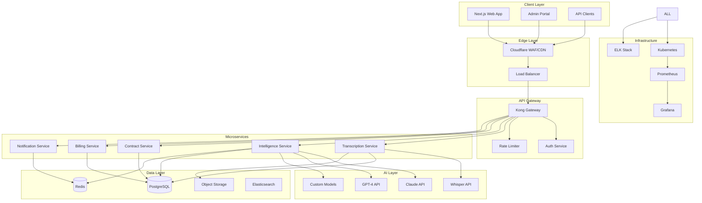

# HangJegyzet.AI Technical Architecture

## 🏗️ System Architecture Overview



## 🔐 Security Architecture

### Defense in Depth

```yaml
layers:
  1_edge:
    cloudflare:
      - WAF rules
      - DDoS protection
      - Bot management
      - SSL/TLS termination
      
  2_network:
    vpc:
      - Private subnets
      - Security groups
      - NACLs
      - VPN access only
      
  3_application:
    authentication:
      - OAuth2/OIDC
      - JWT with short expiry
      - MFA mandatory
      - Session management
      
    authorization:
      - RBAC
      - Resource-based permissions
      - API scoping
      - Tenant isolation
      
  4_data:
    encryption:
      at_rest: AES-256-GCM
      in_transit: TLS 1.3
      key_management: HashiCorp Vault
      
    access_control:
      - Row-level security
      - Column encryption
      - Audit logging
      - Data masking
```

### Threat Model

```typescript
interface ThreatModel {
  external_threats: {
    ddos: "Cloudflare protection + rate limiting",
    injection: "Parameterized queries + input validation",
    xss: "CSP headers + output encoding",
    csrf: "CSRF tokens + SameSite cookies"
  },
  
  internal_threats: {
    privilege_escalation: "Least privilege + regular audits",
    data_leakage: "DLP + encryption + access logs",
    insider_threat: "Behavioral analytics + 2-person rule"
  },
  
  supply_chain: {
    dependencies: "Snyk scanning + vendoring",
    containers: "Signed images + admission control",
    third_party: "Regular security assessments"
  }
}
```

## 🎯 Microservices Design

### Service Definitions

```typescript
// Transcription Service
interface TranscriptionService {
  // Core APIs
  POST   /api/v1/transcriptions
  GET    /api/v1/transcriptions/:id
  GET    /api/v1/transcriptions/:id/status
  DELETE /api/v1/transcriptions/:id
  
  // Webhooks
  POST   /webhooks/transcription/complete
  
  // Internal APIs
  POST   /internal/process-audio
  POST   /internal/optimize-model
  
  dependencies: {
    whisper: "OpenAI Whisper API",
    storage: "S3-compatible object storage",
    queue: "RabbitMQ for job processing",
    cache: "Redis for status updates"
  }
}

// Intelligence Service
interface IntelligenceService {
  // Analysis APIs
  POST   /api/v1/analyze/meeting
  POST   /api/v1/analyze/sentiment
  POST   /api/v1/analyze/actions
  GET    /api/v1/insights/:meeting_id
  
  // ML APIs
  POST   /api/v1/ml/train
  POST   /api/v1/ml/predict
  GET    /api/v1/ml/models
  
  dependencies: {
    llm: ["Claude 3 Opus", "GPT-4"],
    vectorDb: "Pinecone for embeddings",
    mlPlatform: "MLflow for model management"
  }
}
```

### Service Communication

```python
# Event-driven architecture with CQRS
class EventBus:
    def __init__(self):
        self.broker = Kafka()  # or RabbitMQ
        self.schema_registry = SchemaRegistry()
        
    async def publish(self, event: Event):
        # Validate schema
        await self.schema_registry.validate(event)
        
        # Add metadata
        event.metadata = {
            "timestamp": datetime.utcnow(),
            "correlation_id": generate_correlation_id(),
            "source": get_service_name(),
            "version": EVENT_VERSION
        }
        
        # Publish to topic
        await self.broker.publish(
            topic=f"hangjegyzet.{event.type}",
            message=event.to_json(),
            key=event.aggregate_id
        )
        
    async def subscribe(self, pattern: str, handler: Callable):
        await self.broker.subscribe(
            pattern=pattern,
            handler=self._wrap_handler(handler),
            group_id=f"{get_service_name()}-consumer"
        )
```

## 💾 Database Architecture

### PostgreSQL Schema Design

```sql
-- Multi-tenant with row-level security
CREATE SCHEMA core;

-- Organizations (tenants)
CREATE TABLE core.organizations (
    id UUID PRIMARY KEY DEFAULT gen_random_uuid(),
    name VARCHAR(255) NOT NULL,
    slug VARCHAR(100) UNIQUE NOT NULL,
    subscription_tier VARCHAR(50) NOT NULL,
    settings JSONB DEFAULT '{}',
    created_at TIMESTAMPTZ DEFAULT NOW(),
    updated_at TIMESTAMPTZ DEFAULT NOW()
);

-- Users with RBAC
CREATE TABLE core.users (
    id UUID PRIMARY KEY DEFAULT gen_random_uuid(),
    organization_id UUID REFERENCES core.organizations(id),
    email VARCHAR(255) UNIQUE NOT NULL,
    name VARCHAR(255) NOT NULL,
    role VARCHAR(50) NOT NULL,
    permissions JSONB DEFAULT '[]',
    mfa_enabled BOOLEAN DEFAULT false,
    created_at TIMESTAMPTZ DEFAULT NOW(),
    
    INDEX idx_users_org (organization_id),
    INDEX idx_users_email (email)
);

-- Meetings with partitioning
CREATE TABLE core.meetings (
    id UUID DEFAULT gen_random_uuid(),
    organization_id UUID NOT NULL,
    title VARCHAR(255),
    duration_seconds INTEGER,
    recorded_at TIMESTAMPTZ,
    
    -- Encrypted data
    transcript_encrypted BYTEA,
    encryption_key_id UUID,
    
    -- Metadata
    metadata JSONB DEFAULT '{}',
    intelligence_score FLOAT,
    processing_status VARCHAR(50),
    
    -- Audit
    created_by UUID REFERENCES core.users(id),
    created_at TIMESTAMPTZ DEFAULT NOW(),
    updated_at TIMESTAMPTZ DEFAULT NOW(),
    
    PRIMARY KEY (id, created_at),
    FOREIGN KEY (organization_id) REFERENCES core.organizations(id)
) PARTITION BY RANGE (created_at);

-- Create monthly partitions
CREATE TABLE core.meetings_2024_01 PARTITION OF core.meetings
    FOR VALUES FROM ('2024-01-01') TO ('2024-02-01');

-- Row Level Security
ALTER TABLE core.meetings ENABLE ROW LEVEL SECURITY;

CREATE POLICY "tenant_isolation" ON core.meetings
    FOR ALL
    USING (organization_id = current_setting('app.current_org_id')::uuid);

-- Audit log table
CREATE TABLE core.audit_logs (
    id BIGSERIAL PRIMARY KEY,
    organization_id UUID,
    user_id UUID,
    action VARCHAR(100) NOT NULL,
    resource_type VARCHAR(100),
    resource_id UUID,
    changes JSONB,
    ip_address INET,
    user_agent TEXT,
    created_at TIMESTAMPTZ DEFAULT NOW()
) PARTITION BY RANGE (created_at);

-- Indexes for performance
CREATE INDEX idx_audit_logs_org_user 
    ON core.audit_logs (organization_id, user_id, created_at DESC);
```

### Redis Data Structure

```typescript
// Cache design patterns
interface CacheStrategy {
  // Session management
  sessions: {
    key: `session:${sessionId}`,
    ttl: 900, // 15 minutes
    data: {
      userId: string,
      orgId: string,
      permissions: string[],
      lastActivity: timestamp
    }
  },
  
  // Rate limiting
  rateLimit: {
    key: `rate:${userId}:${endpoint}`,
    ttl: 60,
    window: "sliding",
    max: 100
  },
  
  // Distributed locks
  locks: {
    key: `lock:${resource}:${id}`,
    ttl: 30,
    value: `${nodeId}:${timestamp}`
  },
  
  // Real-time updates
  pubsub: {
    channels: [
      "transcription:progress",
      "meeting:insights",
      "system:alerts"
    ]
  }
}
```

## 🤖 AI Pipeline Architecture

### Transcription Pipeline

```python
class TranscriptionPipeline:
    def __init__(self):
        self.preprocessor = AudioPreprocessor()
        self.whisper = WhisperLargeV3()
        self.postprocessor = HungarianPostProcessor()
        self.quality_checker = QualityAssurance()
        
    async def process(self, audio_file: AudioFile) -> Transcript:
        # Step 1: Preprocess audio
        normalized_audio = await self.preprocessor.normalize(
            audio_file,
            target_sample_rate=16000,
            remove_silence=True,
            noise_reduction=True
        )
        
        # Step 2: Chunk for parallel processing
        chunks = self.chunk_audio(normalized_audio, chunk_size=30)
        
        # Step 3: Parallel transcription
        transcription_tasks = [
            self.whisper.transcribe(
                chunk,
                language="hu",
                prompt=HUNGARIAN_BUSINESS_CONTEXT,
                temperature=0.2
            )
            for chunk in chunks
        ]
        
        raw_transcripts = await asyncio.gather(*transcription_tasks)
        
        # Step 4: Post-processing
        merged_transcript = self.merge_chunks(raw_transcripts)
        corrected_transcript = await self.postprocessor.correct(
            merged_transcript,
            domain="business",
            custom_vocabulary=self.get_org_vocabulary()
        )
        
        # Step 5: Quality assurance
        quality_score = await self.quality_checker.assess(
            corrected_transcript,
            original_audio=normalized_audio
        )
        
        if quality_score < 0.95:
            # Fallback to alternative model or manual review
            corrected_transcript = await self.enhance_quality(
                corrected_transcript,
                normalized_audio
            )
        
        return Transcript(
            text=corrected_transcript,
            confidence=quality_score,
            language="hu",
            processing_time=time.elapsed()
        )
```

### Intelligence Analysis Pipeline

```typescript
class IntelligenceAnalyzer {
  private models = {
    claude: new ClaudeClient(),
    gpt4: new GPT4Client(),
    custom: new CustomModelClient()
  };
  
  async analyzeMeeting(transcript: Transcript): Promise<MeetingIntelligence> {
    // Parallel analysis with multiple models
    const [
      claudeAnalysis,
      gptAnalysis,
      customAnalysis
    ] = await Promise.all([
      this.analyzeWithClaude(transcript),
      this.analyzeWithGPT4(transcript),
      this.analyzeWithCustomModel(transcript)
    ]);
    
    // Ensemble the results
    const ensembledResult = this.ensembleResults({
      claude: claudeAnalysis,
      gpt4: gptAnalysis,
      custom: customAnalysis
    });
    
    // Extract specific intelligence
    const intelligence: MeetingIntelligence = {
      summary: ensembledResult.summary,
      keyDecisions: this.extractDecisions(ensembledResult),
      actionItems: this.extractActionItems(ensembledResult),
      sentiment: this.analyzeSentiment(ensembledResult),
      riskFlags: this.identifyRisks(ensembledResult),
      nextSteps: this.suggestNextSteps(ensembledResult),
      
      // Advanced features
      dealProbability: await this.calculateDealProbability(ensembledResult),
      complianceIssues: await this.checkCompliance(ensembledResult),
      marketInsights: await this.extractMarketInsights(ensembledResult)
    };
    
    // Store for continuous learning
    await this.storeForTraining(transcript, intelligence);
    
    return intelligence;
  }
  
  private async analyzeWithClaude(transcript: Transcript) {
    const prompt = `
    Elemezd ezt a magyar üzleti megbeszélést:
    
    ${transcript.text}
    
    Kérlek add meg:
    1. Vezetői összefoglaló (3-5 mondat)
    2. Kulcs döntések listája
    3. Akció pontok (felelős, határidő)
    4. Kockázatok és figyelmeztetések
    5. Következő lépések javaslata
    
    Fontos: Maradj tényszerű, ne adj hozzá információt ami nincs a szövegben.
    `;
    
    return await this.models.claude.complete(prompt, {
      temperature: 0.3,
      maxTokens: 2000
    });
  }
}
```

## 🚀 Deployment Architecture

### Kubernetes Configuration

```yaml
# Production cluster setup
apiVersion: v1
kind: Namespace
metadata:
  name: hangjegyzet-prod
  labels:
    environment: production
    
---
# Transcription service deployment
apiVersion: apps/v1
kind: Deployment
metadata:
  name: transcription-service
  namespace: hangjegyzet-prod
spec:
  replicas: 3
  selector:
    matchLabels:
      app: transcription-service
  template:
    metadata:
      labels:
        app: transcription-service
    spec:
      containers:
      - name: transcription
        image: hangjegyzet/transcription:v1.0.0
        resources:
          requests:
            memory: "2Gi"
            cpu: "1000m"
          limits:
            memory: "4Gi"
            cpu: "2000m"
        env:
        - name: WHISPER_API_KEY
          valueFrom:
            secretKeyRef:
              name: api-keys
              key: whisper
        - name: DATABASE_URL
          valueFrom:
            secretKeyRef:
              name: database
              key: url
        livenessProbe:
          httpGet:
            path: /health
            port: 8080
          initialDelaySeconds: 30
          periodSeconds: 10
        readinessProbe:
          httpGet:
            path: /ready
            port: 8080
          initialDelaySeconds: 5
          periodSeconds: 5
          
---
# HorizontalPodAutoscaler
apiVersion: autoscaling/v2
kind: HorizontalPodAutoscaler
metadata:
  name: transcription-hpa
  namespace: hangjegyzet-prod
spec:
  scaleTargetRef:
    apiVersion: apps/v1
    kind: Deployment
    name: transcription-service
  minReplicas: 3
  maxReplicas: 20
  metrics:
  - type: Resource
    resource:
      name: cpu
      target:
        type: Utilization
        averageUtilization: 70
  - type: Resource
    resource:
      name: memory
      target:
        type: Utilization
        averageUtilization: 80
  - type: Pods
    pods:
      metric:
        name: pending_jobs
      target:
        type: AverageValue
        averageValue: "10"
```

### CI/CD Pipeline

```yaml
# .gitlab-ci.yml
stages:
  - security
  - test
  - build
  - deploy

variables:
  DOCKER_REGISTRY: registry.hangjegyzet.ai
  KUBERNETES_NAMESPACE: hangjegyzet-prod

# Security scanning
security:dependency:
  stage: security
  image: snyk/snyk:node
  script:
    - snyk test --severity-threshold=high
    - snyk monitor
  only:
    - merge_requests
    - main

security:container:
  stage: security
  image: aquasec/trivy
  script:
    - trivy image --severity HIGH,CRITICAL ${CI_REGISTRY_IMAGE}:${CI_COMMIT_SHA}
  only:
    - main

# Testing
test:unit:
  stage: test
  image: node:18-alpine
  services:
    - postgres:15-alpine
    - redis:7-alpine
  script:
    - npm ci
    - npm run test:unit -- --coverage
    - npm run test:integration
  coverage: '/Lines\s*:\s*(\d+\.\d+)%/'
  artifacts:
    reports:
      coverage_report:
        coverage_format: cobertura
        path: coverage/cobertura-coverage.xml

test:e2e:
  stage: test
  image: mcr.microsoft.com/playwright:v1.40.0
  script:
    - npm ci
    - npm run test:e2e
  artifacts:
    when: on_failure
    paths:
      - test-results/
      - playwright-report/

# Build
build:
  stage: build
  image: docker:24-dind
  services:
    - docker:24-dind
  script:
    - docker build 
      --build-arg VERSION=${CI_COMMIT_SHA}
      --build-arg BUILD_DATE=$(date -u +"%Y-%m-%dT%H:%M:%SZ")
      -t ${DOCKER_REGISTRY}/${CI_PROJECT_NAME}:${CI_COMMIT_SHA}
      -t ${DOCKER_REGISTRY}/${CI_PROJECT_NAME}:latest .
    - docker push ${DOCKER_REGISTRY}/${CI_PROJECT_NAME}:${CI_COMMIT_SHA}
    - docker push ${DOCKER_REGISTRY}/${CI_PROJECT_NAME}:latest
  only:
    - main

# Deploy
deploy:staging:
  stage: deploy
  image: bitnami/kubectl:latest
  script:
    - kubectl set image deployment/${CI_PROJECT_NAME} 
      ${CI_PROJECT_NAME}=${DOCKER_REGISTRY}/${CI_PROJECT_NAME}:${CI_COMMIT_SHA}
      -n ${KUBERNETES_NAMESPACE}-staging
  environment:
    name: staging
    url: https://staging.hangjegyzet.ai
  only:
    - main

deploy:production:
  stage: deploy
  image: bitnami/kubectl:latest
  script:
    - |
      helm upgrade --install ${CI_PROJECT_NAME} ./charts/${CI_PROJECT_NAME} \
        --set image.tag=${CI_COMMIT_SHA} \
        --set image.repository=${DOCKER_REGISTRY}/${CI_PROJECT_NAME} \
        --namespace ${KUBERNETES_NAMESPACE} \
        --wait \
        --timeout 10m
  environment:
    name: production
    url: https://hangjegyzet.ai
  when: manual
  only:
    - main
```

## 📊 Monitoring & Observability

### Metrics Collection

```typescript
// Custom business metrics
class MetricsCollector {
  private prometheus = new PrometheusClient();
  
  // Business metrics
  meetingsProcessed = new Counter({
    name: 'hangjegyzet_meetings_processed_total',
    help: 'Total number of meetings processed',
    labelNames: ['organization', 'tier', 'status']
  });
  
  transcriptionAccuracy = new Histogram({
    name: 'hangjegyzet_transcription_accuracy',
    help: 'Transcription accuracy score',
    labelNames: ['language', 'audio_quality'],
    buckets: [0.8, 0.85, 0.9, 0.95, 0.98, 0.99, 1.0]
  });
  
  processingDuration = new Histogram({
    name: 'hangjegyzet_processing_duration_seconds',
    help: 'Time taken to process meetings',
    labelNames: ['service', 'operation'],
    buckets: [1, 5, 10, 30, 60, 120, 300, 600]
  });
  
  // Track custom events
  async trackMeetingProcessed(meeting: Meeting, result: ProcessingResult) {
    this.meetingsProcessed.inc({
      organization: meeting.organizationId,
      tier: meeting.subscriptionTier,
      status: result.status
    });
    
    this.transcriptionAccuracy.observe({
      language: meeting.language,
      audio_quality: result.audioQuality
    }, result.accuracy);
    
    this.processingDuration.observe({
      service: 'transcription',
      operation: 'full_pipeline'
    }, result.duration);
    
    // Business intelligence metrics
    await this.trackBusinessMetrics(meeting, result);
  }
}
```

### Distributed Tracing

```python
# OpenTelemetry setup
from opentelemetry import trace
from opentelemetry.instrumentation.fastapi import FastAPIInstrumentor
from opentelemetry.exporter.jaeger import JaegerExporter

tracer = trace.get_tracer(__name__)

class TracedService:
    @tracer.start_as_current_span("process_meeting")
    async def process_meeting(self, meeting_id: str) -> ProcessingResult:
        span = trace.get_current_span()
        span.set_attribute("meeting.id", meeting_id)
        span.set_attribute("service.version", SERVICE_VERSION)
        
        try:
            # Trace sub-operations
            with tracer.start_as_current_span("fetch_audio") as span:
                audio = await self.fetch_audio(meeting_id)
                span.set_attribute("audio.size", len(audio))
                span.set_attribute("audio.format", audio.format)
            
            with tracer.start_as_current_span("transcribe") as span:
                transcript = await self.transcribe(audio)
                span.set_attribute("transcript.length", len(transcript))
                span.set_attribute("transcript.language", "hu")
            
            with tracer.start_as_current_span("analyze") as span:
                analysis = await self.analyze(transcript)
                span.set_attribute("analysis.score", analysis.score)
                
            return ProcessingResult(
                transcript=transcript,
                analysis=analysis,
                duration=span.end_time - span.start_time
            )
            
        except Exception as e:
            span.record_exception(e)
            span.set_status(trace.Status(trace.StatusCode.ERROR))
            raise
```

This architecture provides a solid foundation for building a scalable, secure, and intelligent meeting transcription platform. Each component is designed with growth in mind while maintaining the highest standards of security and reliability.